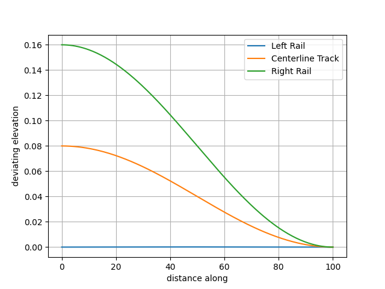
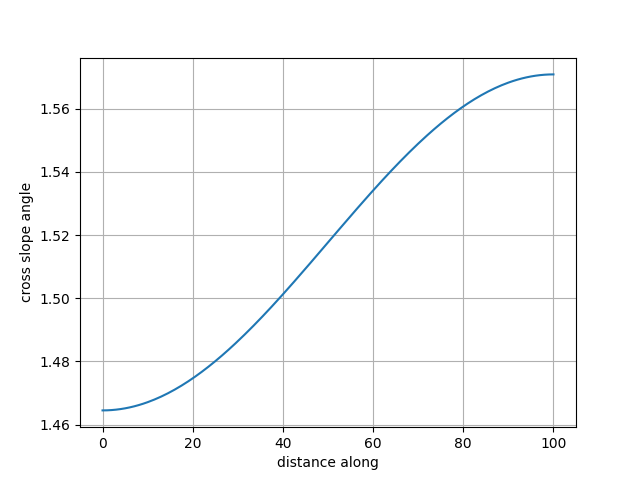

A _IfcSegmentedReferenceCurve_ is a curve defined in a “horizontal distance along base curve, deviating elevation” coordinate system. The _IfcCurveSegment.ParentCurve_ defines the change in cross slope between rail heads over the length of the segment. When the _IfcCurveSegment.Placement.Location_ differs from the _IfcCurveSegmentPlacement.Location_ of the next segment (or the _IfcSegmentedReferenceCurve.EndPoint_ for the last segment, if specified), the _IfcCurveSegment.ParentCurve_ also defines the deviating elevation. If the _IfcCurveSegment.Placement.Location_ is the same as for the start of the next segment, the deviating elevation along the length of the segment is constant.

Evaluation of a _IfcCurveSegment_ that is part of a _IfcSegmentedReferenceCurve_ is illustrated with an example. Consider a _IfcCurveSegment_ with a _IfcCosineSpiral_ parent curve. The curve segment has a position of (0.0,0.08,0.0) and an _Axis_ of (0.0, 0.10606,0.99436). The curve segment has a length of 100. The next curve segment has a position of (100.0,0.0,0.0) and an _Axis_ of (0.0, 0.0,1.0). The constant and cosine terms are both 2500.

The parent curve equation is $D(s)=\frac{L}{A_o} + \frac{L}{A_1}cos(\pi \frac{s}{L})$ where $A_0$ is the constant term and $A_1$ is the cosine term.

The deviating elevation at the start of the segment is $D_s=D(0)=0.08$

The deviating elevation at the end of the segment is $D_e=D(100)=0.0$

The deviating elevation at the segment mid-point is $D=\frac{100}{2500}+\frac{100}{2500}cos(\pi \frac{50}{100})=0.04$

The orientation of the _Axis_ at the start of the segment is $\theta_s=tan^{-1}(\frac{0.99436}{0.10606})=1.46454$

The orientation of the _Axis_ at the end of the segment is $\theta_e = tan^{-1}(\frac{1.0}{0.0}) = 1.570796$

The orientation of _Axis_ at the segment mid-point is $\theta = \theta_s + \frac{(\theta_e -\theta_s)}{(D_e - D_s)}(D-D_s)=1.46484+\frac{(1.570796-1.46454)}{(0.0-0.08)}(0.04-0.08)=1.517968$

The slope of the deviating elevation is the derivative of the parent curve.

$slope = -\frac{\pi}{A_1}sin\pi\frac{s}{L} = -\frac{\pi}{2500}sin\pi\frac{50}{100}=-0.0012567$

$slope angle = tan^{-1}(slope) = -0.0012567$

_RefDirection_ = ($cos(slope angle)$, $sin(slope angle)$ ,0.0)

The Z-Direction at the segment mid-point is (0.0, $cos\theta$, $sin\theta$) = $(0.0,0.05234,0.99863)$

The Y-Direction is the cross product of Z-Direction and _RefDirection_

_Axis_ is the cross product of _RefDirection_ and Y-Direction

Figure 1 shows the deviating elevation of the left rail, right rail, and centerline of track along the length of the segment.

Figure 1 — Deviating elevation along length of segment. Left and right rail deviating elevations computed assuming a railhead distance of 1.5 m.

Figure 2 shows the orientation variation of _Axis_ along the length of the segment

Figure 2 — Orientation of _Axis_ along length of segment.

