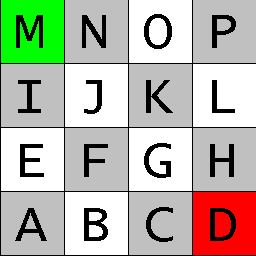

The tessellated shape representation includes an indexed texture coordinate list, providing texture vertices for each face, along with a texture referenced by URL. Figure 483 shows a cylinder with faces having specific texture coordinates. The texture for use in this model is provided in Figure 484.

Figure 483 — Tessellation with textures

Figure 484 — Texture image for use in this model

